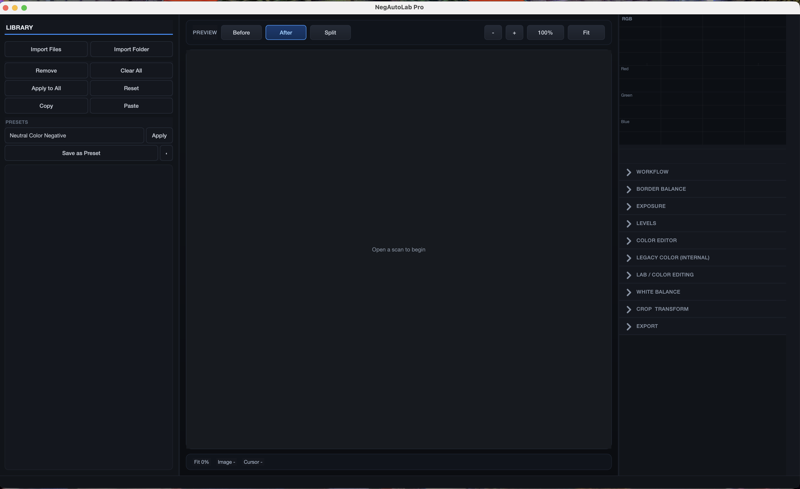
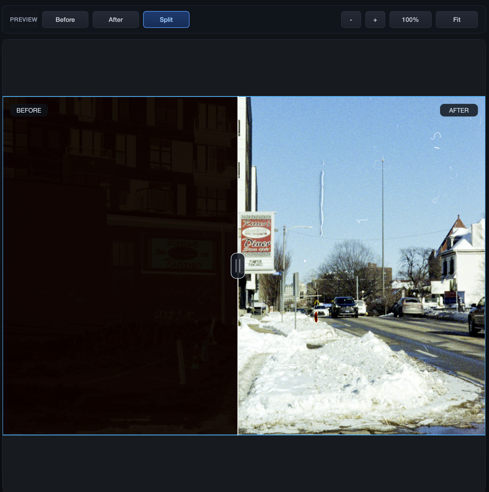

# NegAutoLab Pro

Professional desktop software for film negative inversion, scanning workflow, and non-destructive image editing.

## Overview

NegAutoLab Pro is a PyQt6-based desktop application designed for working with film scans, including color negatives, black-and-white negatives, and positive images. It provides a responsive preview workflow, per-image editing controls, histogram tools, crop and white-balance utilities, preset management, and full-resolution export.

## Features

- Color negative, B&W negative, and positive support
- Automatic and manual orange mask / border balance workflow
- Non-destructive per-image editing
- Fast proxy preview rendering
- Full-resolution export pipeline
- White balance picker and auto white balance
- Levels, contrast, saturation, HSL, and LAB controls
- Crop, rotate, and flip tools
- RGB histogram
- TIFF and JPEG export
- Batch workflow support
- Preset save/load system
- ICC color profile support

## Tech Stack

- Python 3.9+
- PyQt6
- NumPy
- OpenCV
- Pillow
- rawpy
- tifffile

## Project Structure

```text
main.py
core/
models/
services/
ui/
icc/
docs/
LICENSE
README.md
```

## Installation

### 1. Clone the repository

```bash
git clone https://github.com/saidmrigua/NegAutoLab-Pro.git
cd NegAutoLab-Pro
```

### 2. Create a virtual environment

```bash
python3 -m venv .venv
source .venv/bin/activate
```

On Windows:

```bash
.venv\Scripts\activate
```

### 3. Install dependencies

```bash
pip install --upgrade pip
pip install -r requirements.txt
```

### 4. Run the application

```bash
python main.py
```

## Interface Preview

Add your screenshots in the `assets/screenshots/` folder and update the filenames below if needed.

### Main Window



### Editing Workflow


### Before / After Preview



## Sample Scans

Add your sample images in the `assets/samples/` folder and update the filenames below if needed.

### Sample Input


### Sample Result


## Demo Video

A short workflow demo can be included in the repository:

[Watch the demo video](assets/demo/negautolab-demo.mp4)

## Recommended Workflow for Best Results

For the best and most consistent results:

1. Import the image first
2. Apply crop before starting detailed adjustments
3. Use the crop to isolate only the real image area and remove unnecessary borders
4. If multiple images share the same framing, apply the same crop consistently across them
5. After cropping, begin the main editing workflow such as inversion, white balance, tone, and color correction

Cropping early helps the software focus on the useful image area and improves consistency for inversion, border correction, and color rendering.

## Workflow

1. Open one or more images
2. Select an image from the filmstrip
3. Adjust film mode and negative settings
4. Apply white balance, tone, and color edits
5. Crop or compare preview states
6. Export as TIFF or JPEG
7. Reuse settings through presets or batch workflow

## Supported Image Types

- TIFF
- JPEG
- PNG
- RAW formats supported through `rawpy`

## Running the Application

```bash
python main.py
```

## Export

NegAutoLab Pro supports:

- TIFF export
- JPEG export
- Full-resolution processing on export
- Per-image settings applied non-destructively
- ICC-aware output workflow

## Documentation

Additional documentation is included in the `docs/` folder:

- `docs/ARCHITECTURE.md`
- `docs/APP_AUDIT.md`

## License

NegAutoLab Pro is distributed under a non-commercial license.

You may use, study, modify, and share this software for personal, educational, research, and other non-commercial purposes only.

Commercial use is not permitted without prior written permission from the author.

For commercial licensing inquiries, contact: **saidmrigua@gmail.com**

## Author

**Said Mrigua**  
Email: **saidmrigua@gmail.com**

## Sample Scans

Some sample images included in this repository are used with permission for testing and demonstration purposes.

**Credit:** Sample image used with permission from **.liznin.** (from **r/AnalogCommunity**). Original image rights remain with the owner.